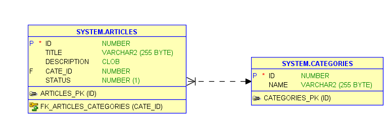

# API-Mobile-Banking
This is project backend API building with Spring boot MyBatis Open Source Persistence Framework for implement SQL Database.
# Database Schema 
# Tables Structure

Categories Table using Query run on Oracle support :

CREATE TABLE categories(
    id NUMBER GENERATED BY DEFAULT AS IDENTITY PRIMARY KEY,
    name VARCHAR(255)
);

# Articles Table

CREATE TABLE articles(
    id NUMBER GENERATED BY DEFAULT AS IDENTITY PRIMARY KEY,
    title VARCHAR(255),
    description CLOB,
    cate_id NUMBER,
    status NUMBER(1) DEFAULT 1,
    CONSTRAINT fk_articles_categories FOREIGN KEY (cate_id) REFERENCES categories(id)
);

# Table Relationships

| Table   | Relationship | Relate Table | Foreign Key |

| articles| Many-to-One  | categories   | cate_id → categories(id)|

# Relationship Diagram

 
# configure application properties connection with database Oracle

server.port=9000

spring.datasource.url=jdbc:oracle:thin:@//localhost:1521/orcl

spring.datasource.username=system

spring.datasource.password=123456

spring.datasource.driver-class-name=oracle.jdbc.OracleDriver

# From Data Validation with Bean Validator.

- spring boot validation dependency :

   implementation 'org.springframework.boot:spring-boot-starter-validation:3.5.4'

- Let's define a simple POJO, with field that we want to validate.

  * @NotEmpty: is used for constrain a field of type String Collection or Array to not be null or Empty.
  * @Min and @Max: are used to specify the limits of a variable.
  * @NotNull: tells spring boot the filed should not be null, but it can be empty.
  * @NotBlank: tells spring boot the filed should not be null and constrains at least one non whitespace character.
  * @Size: [min =x, max=y] is used define rules of the size a String Collection, or Array Map.
  * @Email: helps us to validate the string against a regex which defines the structure of a validate email.
  * @Positive: is used to strictly positive number.

